# 基于微服务的社区跑腿小程序的设计与实现

> 公开脱敏版：保留论文正文与技术插图；学校模板、页眉页脚、校徽、身份元数据不进入公开文件，含个人资料或凭据的截图已隐藏。

目 录

## 绪论

### 选题背景

随着社会生活的节奏不断加快，人们的生活方式也在发生着巨大的变化。在繁忙的生活中，有时候我们会遇到一些琐事或紧急情况，需要及时解决，但又因为自身忙碌或条件限制而无法亲自出门处理。因此，基于微服务的社区跑腿小程序应运而生，旨在解决人们日常生活中的诸多难题，提供高效便捷的服务，满足用户的各种需求。

传统的跑腿服务存在着诸多不便，比如服务范围有限、时效性不高、信息不透明等问题。而基于微服务的社区跑腿小程序则能够有效应对这些问题，为用户提供更加便捷、高效的服务。通过小程序平台，用户可以随时随地提交跑腿订单，包括代购、送餐、快递取送、排队等各种服务。而微服务架构的优势在于，将各个功能模块拆分成独立的服务，每个服务负责一个特定的功能，使得系统更加灵活、可扩展性更强，能够更好地适应不同规模和需求的用户。

基于微服务的社区跑腿小程序将采用先进的技术和架构，以保障系统的稳定性和用户体验。后端服务将采用Spring Boot框架与Nacos，通过服务注册与发现、负载均衡、断路器等功能，实现服务之间的高效通信和协作。数据库将采用MySQL等关系型数据库，用于存储用户信息、订单信息等数据。前端则采用Vue.js等流行的前端框架，实现小程序的页面展示和交互操作，为用户提供友好的界面和良好的使用体验。

在功能方面，基于微服务的社区跑腿小程序将提供一系列实用的功能模块，以满足用户的多样化需求。首先是用户注册与登录模块，用户可以通过手机号快速注册并登录小程序，享受更多的服务。其次是订单管理模块，用户可以方便地提交订单、查看订单状态和历史订单等。同时还包括支付功能模块，支持多种支付方式，保障用户支付的安全和便捷。此外，还将提供评价与反馈模块，用户可以对服务进行评价和反馈，帮助提升服务质量和用户满意度。综上所述，基于微服务的社区跑腿小程序将成为人们生活中不可或缺的一部分，为用户提供便捷、高效的生活服务，促进社区经济的发展和社会的进步。

### 国内外发展现状

在当前全球化的背景下，社区跑腿服务已经成为了人们生活中不可或缺的一部分，为人们提供了诸多便利。国内外对社区跑腿服务的发展现状呈现出以下几个特点：

国内发展现状：

中国作为全球最大的互联网市场之一，社区跑腿服务得到了快速发展。在大城市，各种跑腿服务平台如雨后春笋般涌现，其中最为知名的有美团跑腿、饿了么跑腿、蜂鸟跑腿等。这些平台通过线上下单、线下配送的模式，为用户提供了从快递、外卖、购物到生活服务等全方位的跑腿服务。同时，社区跑腿服务也日益走向细分化和专业化，比如专门提供老年人代购、宠物寄养等特定服务的平台也开始涌现。

随着移动支付、共享经济的发展，用户对社区跑腿服务的需求不断增加，市场潜力巨大。同时，政府对社区服务业的支持也在不断加强，鼓励企业创新服务模式、提升服务质量，推动社区经济的发展。

国外发展现状：

在国外，社区跑腿服务也得到了广泛应用，但相比中国市场，发展相对较晚。在欧美等发达国家，类似的跑腿服务平台也逐渐兴起，比如美国的Postmates、Uber Eats，英国的Deliveroo等。这些平台同样提供从外卖、快递到零售购物等各种服务，满足用户的多样化需求。

与国内市场相比，国外的社区跑腿服务市场发展相对缓慢，主要原因包括市场规模相对较小、社区服务文化不同等。但随着共享经济和移动支付的普及，以及新冠疫情对线上服务的推动，社区跑腿服务在国外也逐渐受到关注和欢迎，市场潜力逐渐被挖掘。

总体趋势：

无论是国内还是国外，社区跑腿服务的发展趋势都是积极向好的。随着科技的进步和人们生活水平的提高，人们对生活服务的需求也越来越多样化、个性化，社区跑腿服务将成为未来社会生活中不可或缺的一部分。同时，随着市场竞争的加剧和技术的不断创新，社区跑腿服务行业也将迎来更多的发展机遇和挑战。

### 目的与意义

社区跑腿小程序的目的在于为人们提供便捷、高效的生活服务平台，解决日常生活中的各种需求。通过该小程序，用户可以随时随地发布各种生活任务，如购物、取件、送餐等，而服务提供者则可以通过接单来获取收入，实现资源共享和互利共赢。

社区跑腿小程序提供了一种全新的生活服务模式，使得用户可以方便地获取各种生活服务，节省时间和精力，提高生活质量。

该小程序促进了社区经济的发展。通过连接用户和服务提供者，促进了本地服务业的发展，创造了就业机会，增加了居民的收入，推动了社区经济的繁荣。

社区跑腿小程序有助于提升社区居民的幸福感和归属感。居民可以在社区内找到所需的各种生活服务，增强了社区的凝聚力和团结感，促进了社区和谐发展。

社区跑腿小程序还有助于推动城市智能化建设。借助互联网技术和智能化手段，实现了服务的智能化管理和信息化交流，提高了服务效率和用户体验，推动了城市服务行业的创新和进步。

社区跑腿小程序的推出旨在满足人们多样化的生活需求，促进社区经济发展，提升社区居民的幸福感和生活品质，推动城市智能化建设，具有重要的现实意义和社会价值。

## 关键技术介绍

### 关键性开发技术介绍

#### Spring Boot

Spring Boot是Spring框架的进化产物，以其约定大于配置的理念，极大地简化了Spring框架的配置繁琐性。通过引入Spring Boot Starter和结合Maven工具，开发人员能够迅速搭建起整合了Spring、Spring MVC、MyBatis等框架的系统，形成一套高效的SSM框架。

它就像一把魔法钥匙，能够以惊人的速度解锁开发过程中的诸多烦扰。Spring Boot通过一系列默认配置，让开发者可以不再为琐碎的配置而烦恼，而是专注于业务逻辑的实现。它的独特之处在于不仅仅提供了快速搭建的能力，还通过内置Tomcat服务器的方式，使得整个开发过程更加轻松，不再需要额外的服务器配置和部署步骤。

#### Vue

Vue是一种流行的JavaScript前端框架，以其简洁易用、响应式数据绑定、组件化开发等特点而闻名。在宠物领养管理系统中，Vue扮演着关键角色。它帮助开发者构建交互性强、用户友好的界面，通过数据绑定和事件处理实现页面与用户的交互功能，提升用户体验。Vue的组件化开发能够有效管理和复用系统中的功能模块，提高了系统的可维护性和扩展性。同时，Vue的响应式数据绑定机制确保了数据变化时界面的及时更新，保证系统的实时性和准确性。在构建单页面应用时，Vue Router提供了便捷的路由管理工具，使得用户操作更加流畅和自然。综上所述，Vue在宠物领养管理系统中发挥着重要作用，为系统的开发提供了高效、响应式的解决方案。

#### MySQL数据库

MySQL是一种流行的关系型数据库管理系统，以其高性能、稳定性和开源免费等特点而广泛应用。MySQL支持SQL语言，能够存储和管理大量结构化数据，适用于各种规模的应用场景。

在宠物领养管理系统中，MySQL扮演着重要角色。首先，MySQL用于存储和管理系统中的各类数据，如宠物信息、用户信息、订单信息等。通过MySQL的高效存储和检索功能，可以快速地对数据进行增删改查操作，保证了系统的数据安全和完整性。其次，MySQL提供了可靠的事务处理机制，保证了数据的一致性和可靠性，避免了数据丢失或损坏的风险。此外，MySQL还支持数据备份和恢复功能，能够在系统发生故障时快速恢复数据，保障系统的稳定运行。综上所述，MySQL作为宠物领养管理系统的数据库，能够有效地存储和管理系统中的数据，保证系统的稳定性、可靠性和安全性，为系统提供了可靠的数据支撑和保障。

#### MyBatis

MyBatis是一种Java持久层框架，它提供了一种优雅的方式来将Java对象与数据库表进行映射，并通过XML或注解配置SQL语句，实现了对数据库的访问操作。MyBatis具有简单易用、灵活性高、性能优越等特点。

在宠物领养管理系统中，MyBatis扮演着重要角色。首先，MyBatis通过配置SQL语句，实现了对数据库的CRUD操作，包括查询、插入、更新和删除等，使得开发者能够以面向对象的方式操作数据库，提高了开发效率。其次，MyBatis支持动态SQL语句的生成，能够根据不同的条件动态拼接SQL语句，实现灵活的数据查询和操作。此外，MyBatis还提供了一级缓存和二级缓存机制，能够有效地减少数据库访问次数，提升系统的性能和响应速度。综上所述，MyBatis在宠物领养管理系统中发挥着重要作用，通过简单灵活的方式实现了对数据库的访问操作，提高了系统的开发效率和性能表现。

### 其它相关技术

#### HTTP请求

HTTP（Hypertext Transfer Protocol）是一种用于传输超文本数据的应用层协议，它是Web的基础之一。通过HTTP协议，客户端（通常是浏览器）可以向服务器发送请求，并从服务器接收响应，实现了客户端与服务器之间的通信和数据交换。

在宠物领养管理系统中，HTTP请求技术扮演着至关重要的角色。首先，宠物领养管理系统通常是基于Web的应用程序，客户端需要向服务器发送各种类型的请求，如获取宠物信息、提交订单、更新用户信息等。HTTP请求技术通过定义不同的请求方法（如GET、POST、PUT、DELETE等），实现了对不同操作的标准化和规范化，确保了请求的准确性和有效性。其次，HTTP请求技术支持在请求头中添加各种参数和信息，如请求头、请求体、Cookie等，可以传递用户身份认证信息、请求参数等，从而实现了用户身份的验证和数据的传递。此外，HTTP请求技术还支持跨域请求、文件上传、会话管理等功能，为宠物领养管理系统的开发和运行提供了丰富的功能和灵活性。

#### Nacos

Nacos（又称阿里巴巴注册中心）是一个开源的分布式服务注册、发现和配置管理平台，它提供了服务发现、配置管理、动态DNS等功能，支持多种语言、多种环境、多种协议的注册和发现。Nacos致力于帮助用户更好地构建、演化和管理微服务架构。

作为服务注册与发现的核心组件，Nacos提供了一种简单且可扩展的方式来实现服务注册、发现和管理。通过Nacos，用户可以轻松地注册微服务实例，并通过服务名来查找和调用对应的服务。同时，Nacos支持服务健康检查、故障自动摘除、流量管理等功能，保证了服务的高可用性和稳定性。

#### Uni-App

Uni-App是一个基于Vue.js框架的跨平台应用开发框架，能够实现一套代码，同时发布到iOS、Android、Web等多个平台。它采用了统一的开发语法和组件规范，支持使用Vue.js全家桶进行开发，并提供了丰富的组件库和插件，使开发者能够高效地构建复杂的跨平台应用。

Uni-App具有高度的灵活性和可扩展性，开发者可以使用原生的API或插件扩展来访问设备的功能，如摄像头、地理位置、推送通知等，实现更丰富的应用功能。同时，Uni-App还提供了丰富的跨端解决方案，包括页面适配、路由管理、打包发布等功能，使得开发者能够轻松地实现跨平台开发，并提高开发效率。

## 系统分析

### 功能性需求分析

经过对市场的调研与研究，我们发现随着社区生活节奏的加快，人们对于生活服务的需求日益增长，尤其是社区跑腿服务的需求呈现出明显的增加趋势。然而，现有的社区跑腿服务普遍存在着服务范围狭窄、服务响应时间慢、服务质量不稳定等问题，给用户带来了不便和不满。因此，我们决定利用先进的互联网技术和移动端应用开发技术，打造一款高效、便捷、可靠的社区跑腿小程序，以满足用户多样化的生活服务需求，提升用户体验和生活质量。

当前市场上存在着一些功能单一、体验不佳的社区跑腿小程序，缺乏完善的管理和运营机制。因此，我们将通过该小程序实现管理员和用户两个角色的功能需求，并建立完善的订单管理、用户管理和评价体系，以确保服务的高效运作和良好的用户体验。

具体来说，我们的系统将实现管理员角色的登录、订单管理、骑手管理、认证信息管理、收支信息管理、评价管理、公告管理、管理员管理、用户管理、个人中心、修改密码等功能；用户角色将具备注册、登录等功能。

#### 管理员需求分析

系统管理员用户主要负责系统整体数据的管理与维护，拥有登录、订单管理、骑手管理、收支信息管理、评价管理、公告管理、管理员管理、用户管理、修改密码等功能，用例图如图3.1所示。

图3.1 管理员用户用例图

登录用例描述如表3.1所示，该表主要阐述了管理员用户登录过程中的主要事件流程与前置，后置条件。

表3.1 登录用例表

<table>
<tr><td>用例名称</td><td>登录用例</td></tr>
<tr><td>参与者</td><td>管理员用户</td></tr>
<tr><td>描述</td><td>管理员用户输入账号，密码进行系统登录</td></tr>
<tr><td>前置条件</td><td>无</td></tr>
<tr><td>后置条件</td><td>无</td></tr>
<tr><td>事件流</td><td>管理员用户进入系统后台登录界面 输入账号与密码，点击登录按钮 系统对管理员用户输入的账号与密码进行判断；判断通过登入成功，系统跳转首页；判断未通过，登录失败，系统提示失败原因</td></tr>
</table>

管理员用户可以在订单管理模块对本系统所有订单进行查询，删除操作，并可以修改订单状态为已取消，待接单，待送达，待收货，待评价，已完成，用例描述如表3.2所示。

表3.2 订单管理

<table>
<tr><td>用例名称</td><td>订单管理</td></tr>
<tr><td>参与者</td><td>管理员用户</td></tr>
<tr><td>描述</td><td>管理员用户对本系统中的所有订单进行数据维护</td></tr>
<tr><td>前置条件</td><td>成功登入系统</td></tr>
<tr><td>后置条件</td><td>无</td></tr>
<tr><td>事件流</td><td>进入订单管理界面，可以进行分页查询，订单编号查询 查看查询的结果，查看取货与送货信息，界面弹出弹窗，展示送货或取货信息 编辑订单的状态，将订单状态修改为：已取消，待接单，待送达，待收货，待评价，已完成中的一个，修改后界面自动更新 进行某个订单的删除，删除后界面自动更新</td></tr>
</table>

管理员用户可以进行骑手认证信息查询，审核，用例描述如表3.3所示。

表3.3 骑手管理

<table>
<tr><td>用例名称</td><td>骑手管理</td></tr>
<tr><td>参与者</td><td>管理员用户</td></tr>
<tr><td>描述</td><td>查询骑手信息，审核骑手信息</td></tr>
<tr><td>前置条件</td><td>成功登入系统</td></tr>
<tr><td>后置条件</td><td>无</td></tr>
<tr><td>事件流</td><td>进入骑手管理界面，进行骑手名称查询 对查询的结果进行审核操作；审核通过与否，界面都将刷新 对骑手进行删除操作，删除成功与否，界面都将刷新</td></tr>
</table>

收支明细用例描述如表3.4所示，管理员用户可以进行收支信息的查询，来了解本系统的收益情况，用例描述如表3.4所示。

表3.4 收支明细用例表

<table>
<tr><td>用例名称</td><td>收支明细</td></tr>
<tr><td>参与者</td><td>管理员用户</td></tr>
<tr><td>描述</td><td>进行收支明细的查询</td></tr>
<tr><td>前置条件</td><td>成功登入系统</td></tr>
<tr><td>后置条件</td><td>无</td></tr>
<tr><td>事件流</td><td>进入收支明细界面，进行名字查询 查询的结果将显示所有收益类型数据：支出，骑手，充值 管理员用户可以删除某条数据，删除成功与否，界面都将刷新</td></tr>
</table>

#### 小程序用户需求分析

小程序用户主要具有登录，注册，订单管理，个人信息管理，评价管理，钱包管理，下单等用例，帮助社区用户进行远程下单与接单，用例图如图3.2所示。

图3.2 小程序用户用例图

注册用例描述如表3.5所示，小程序用户输入个人基本信息，完成账号注册，只有在系统中存在的账号，才可以进行小程序登录。

表3.5 注册用例表

<table>
<tr><td>用例名称</td><td>注册</td></tr>
<tr><td>参与者</td><td>小程序用户</td></tr>
<tr><td>描述</td><td>输入个人基本信息，完成系统账号注册</td></tr>
<tr><td>前置条件</td><td>无</td></tr>
<tr><td>后置条件</td><td>无</td></tr>
<tr><td>事件流</td><td>进入小程序，点击注册按钮，进入注册界面 输入账号，密码，点击注册 如果注册成功，小程序跳转登录页面 如果注册失败，小程序提示失败信息</td></tr>
</table>

在订单管理功能中，小程序用户可以方便地查看个人所有订单并实时了解订单状态。此功能使用户能够轻松地跟踪订单的处理进度，及时了解订单的状态更新和预计送达时间，从而更好地安排自己的时间和行程。此外，用户还可以对未接单的订单进行取消或删除操作，以便及时调整订单，提高用户的满意度和体验，用例描述如表3.6所示。

表3.6 订单管理

<table>
<tr><td>用例名称</td><td>订单管理</td></tr>
<tr><td>参与者</td><td>小程序用户</td></tr>
<tr><td>描述</td><td>查看个人发布的订单状态，并进行取消/评价/确认收货操作</td></tr>
<tr><td>前置条件</td><td>小程序用户登入系统</td></tr>
<tr><td>后置条件</td><td>无</td></tr>
<tr><td>事件流</td><td>进入订单管理界面，界面默认展示全部订单 用户点击上方筛选框，进行订单状态筛选 界面展示筛选后的数据 如果订单状态是待接单，界面展示取消按钮；如果是待收货，界面展示收货按钮；如果是待评价，界面展示评价按钮 小程序用户点击相应按钮后，界面刷新，订单状态更新</td></tr>
</table>

下单用例描述如表3.7所示，小程序用户输入收货地址/取货地址，物品基本信息（名称，重量）选择小费进行跑腿任务下单，具体如表3.7所示。

表3.7 下单

<table>
<tr><td>用例名称</td><td>下单</td></tr>
<tr><td>参与者</td><td>小程序用户</td></tr>
<tr><td>描述</td><td>新增跑腿订单</td></tr>
<tr><td>前置条件</td><td>小程序用户登入系统</td></tr>
<tr><td>后置条件</td><td>无</td></tr>
<tr><td>事件流</td><td>点击下单按钮，进入下单界面 输入跑腿订单基本信息（取货地址，收货地址，物品名称，描述信息，重量，小费，订单类型，图片，备注），点击提交订单 等待骑手接单</td></tr>
</table>

骑手认证的流程如表3.8所示，该流程包括用户提交认证申请、系统审核认证信息和认证通过等步骤。通过这一优化，系统可以保障用户的安全和信任，提升用户对平台的信心和满意度，同时也增强了骑手的责任感和服务质量，从而促进了跑腿订单的顺利进行和用户体验的提升。

表3.8 骑手认证

<table>
<tr><td>用例名称</td><td>骑手认证</td></tr>
<tr><td>参与者</td><td>小程序用户</td></tr>
<tr><td>描述</td><td>小程序用户在小程序中进行骑手认证，认证后可以进行接单</td></tr>
<tr><td>前置条件</td><td>小程序用户成功登入系统</td></tr>
<tr><td>后置条件</td><td>无</td></tr>
<tr><td>事件流</td><td>进入骑手认证界面 输入认证基本信息：姓名，照片，联系方式，身份证号，身份证照片，地址 点击提交按钮，等待后台审核；后台审核通过，该用户可以进行接单；审核未通过，该用户无法进行接单</td></tr>
</table>

认证成功的骑手可以进行接单操作。一旦接单成功，骑手可以点击送达按钮，通知顾客订单已送达。顾客收到通知后，可以点击完成按钮确认收货。完成订单后，顾客可以对订单进行评价，评价内容如表3.9所示

表3.9 接单

<table>
<tr><td>用例名称</td><td>接单</td></tr>
<tr><td>参与者</td><td>小程序用户</td></tr>
<tr><td>描述</td><td>骑手接单，送达后，奖励骑手金额，扣除下单用户金额，下单用户可以评价</td></tr>
<tr><td>前置条件</td><td>成功登入小程序</td></tr>
<tr><td>后置条件</td><td>无</td></tr>
<tr><td>事件流</td><td>骑手在接单页面进行接单 骑手送达订单 顾客同意收货，骑手收到奖励金额，顾客扣除奖励金额 顾客进行评价</td></tr>
</table>

### 非功能性需求分析

小程序需要具备良好的性能，包括快速响应用户请求、高并发处理能力和稳定的运行性能，确保用户能够流畅地使用服务。

小程序应具备高可用性，保证服务的持续可用，减少因系统故障或维护而造成的服务中断时间，提供稳定可靠的用户体验。

小程序需要具备强大的安全性，包括数据传输的加密、用户身份验证、权限控制等功能，确保用户数据的保密性和完整性，防止信息泄露和非法访问。

小程序应具备良好的可扩展性，能够支持系统的持续增长和业务的扩展，方便根据需求动态调整和扩展系统资源。

小程序的代码结构应清晰、模块化，易于维护和管理。同时，应提供完善的日志记录、监控和报警机制，方便运维人员及时发现和解决问题。

基于微服务的社区跑腿小程序需要满足性能、可用性、安全性、可扩展性、可维护性和易用性等非功能性需求，以提供稳定、安全、高效、易用的服务，满足用户的需求和期待。

### 可行性分析

经济可行性：随着社区生活节奏的加快，人们对生活服务的需求不断增长，跑腿服务市场潜力巨大。投入微服务社区跑腿小程序的开发成本主要包括人力、技术、市场推广等方面。但由于微服务架构的灵活性和可扩展性，可以降低开发和维护成本，从而提高项目的经济可行性。

技术可行性：基于微服务架构的社区跑腿小程序能够充分利用云计算、容器化、自动化部署等先进技术，实现系统的高性能、高可用和可扩展，满足用户对服务质量和响应速度的要求。同时，选用流行的开发框架和工具，如Spring Boot、Vue.js等，保证项目的技术可行性。

市场可行性：社区跑腿服务市场需求旺盛，而现有服务存在服务范围狭窄、服务质量不稳定等问题，为微服务社区跑腿小程序提供了市场机会。通过市场调研和用户反馈，可不断优化产品功能和用户体验，提升竞争力，确保项目的市场可行性。

法律可行性：在开发和运营微服务社区跑腿小程序过程中，需遵守相关法律法规，包括用户数据隐私保护、支付安全、服务合规等方面的规定。建立完善的用户协议、隐私政策和服务协议，加强信息安全保护和合规管理，确保项目的法律可行性。

基于微服务的社区跑腿小程序项目在经济、技术、市场和法律方面具有较高的可行性。通过合理规划和实施，可以有效降低风险，提高项目的成功率和可持续发展能力，为用户提供优质的生活服务，同时实现项目的经济效益和社会价值。

## 系统设计

### 架构设计

该系统采用B/S架构模式，前端包括微信小程序端和后台PC管理端，均为浏览器端。后端采用Spring Boot框架，服务配置由Nacos提供，数据层采用MyBatis，数据库为MySQL。系统流程如下：App端或PC端通过HTTP通信机制请求服务端接口。由于涉及跨域请求，服务端需进行跨域处理。服务端接口通过MyBatis操作MySQL数据库，将结果以JSON形式返回。详细架构如图4.1所示。

图4.1 系统架构图

服务端采用微服务架构模式，有Nacos，网关gateWay，用户注册登录服务，主业务服务组成，其中Nacos为配置中心与服务发现中心，网关gateWay为路由分发，对前端的请求进行分发，让其访问不同的服务，用户注册登录服务为小程序的注册登录与后台登录，主业务服务主要实现：订单管理，个人信息管理登录功能，架构如图4.2所示。

### 功能设计

#### 系统登录设计

系统登录功能中，小程序用户与管理员用户共有一个接口，用户通过微信小程序端或PC管理端发起登录请求，服务端接收请求后进行参数验证，根据参数的完整性进行相应的处理。如果参数完整且正确，服务端查询用户信息，并根据角色判断执行相应的登录操作，如果是管理员则调用管理员接口，操作管理员表，反之则调用用户接口，操作用户表，最终生成Token并返回登录结果，若参数不完整，则返回参数缺失错误信息，时序图如图4.2所示。

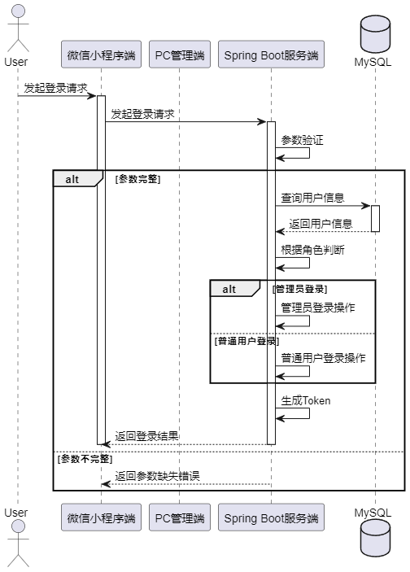

图4.2 系统登录时序图

#### 系统注册设计

系统注册功能只有小程序用户才可以操作，小程序用户访问系统注册接口，服务端接收请求后进行参数验证，根据参数的完整性进行相应的处理。如果参数完整且正确，服务端根据角色判断执行注册操作，如果是小程序用户则将账户信息存入数据库，并返回注册成功消息，如果不是小程序用户（比如请求来自PC端）则禁止其操作，若参数不完整，则返回参数缺失错误信息，时序图如图4.3所示。

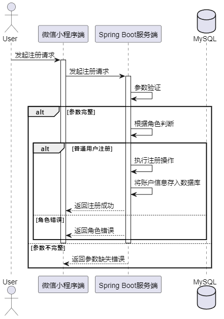

图4.3 系统注册时序图

#### 小程序用户下单设计

小程序用户通过微信小程序端发起下单请求，服务端接收请求后，首先获取当前用户信息，然后检查用户余额是否足够支付订单。如果余额充足，则扣除用户账户余额、更新用户账户信息、生成唯一订单编号、插入订单信息到数据库并记录收支明细，最后返回下单成功消息。如果余额不足，则返回余额不足错误消息，时序图如图4.4所示。

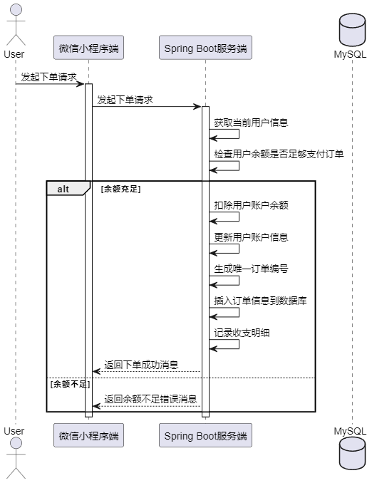

图4.4 小程序下单时序图

#### 小程序用户骑手认证设计

小程序用户通过微信小程序端提交认证信息。服务端首先接收请求，然后检查该用户是否已存在认证信息。若用户没有认证信息，则将新的认证信息插入数据库，并返回认证成功消息。若用户已存在认证信息，则返回已存在认证信息错误消息。时序图如图4.5所示。

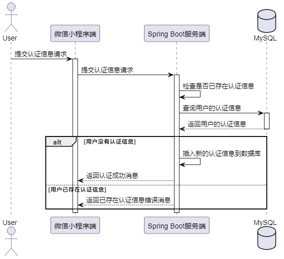

图4.5 骑手认证时序图

#### 骑手接单设计

骑手用户通过微信小程序端向服务端发送请求接单请求，服务端接收请求后，首先获取当前骑手用户信息，然后根据订单状态进行相应的处理。如果订单状态为"待送达"，则执行骑手送达订单的操作，并更新骑手账户余额，记录收支明细，并返回接单成功消息。如果订单状态为"已取消"，则记录订单取消信息，记录收支明细，并返回订单已取消消息，如图4.6所示。

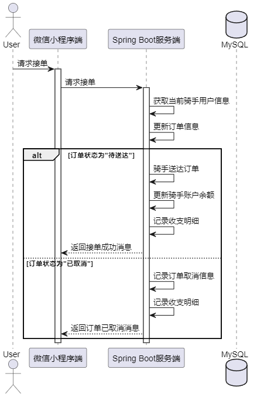

图4.6 骑手接单时序图

#### 小程序用户评价设计

小程序用户通过小程序向服务端发起评论请求，服务端接收请求后，首先设置当前时间，并插入评论到数据库。然后，服务端获取订单信息并更新订单状态为已完成。如果订单状态更新成功，则获取用户评论信息和骑手评论信息，并更新缓存信息，最后返回评论成功消息。如果订单状态更新失败，则返回评论失败消息，时序图如图4.7所示。

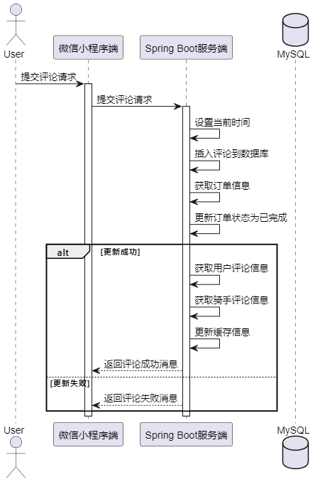

图4.7 小程序用户评价时序图

#### 订单管理功能设计

本系统是社区跑腿小程序，一个社区有着众多用户，且存在众多订单，如果仅靠管理员人工管理订单，耗时耗力，因此服务端提供定时任务进行订单自动管理，服务端定时执行订单扫描任务，首先查询所有待接单订单，然后遍历订单列表，计算订单时间与当前时间的差值。如果订单超时（超过5分钟），则取消订单，归还用户金额，并记录收支明细；如果订单未超时，则继续扫描下一个订单，时序图如图4.8所示。

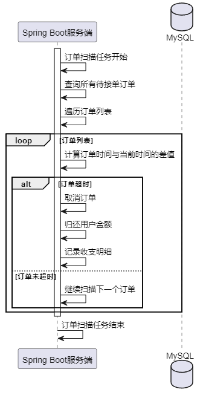

图4.8 订单管理定时任务时序图

#### 用户管理功能设计

后台管理员用户可以进行小程序用户与后台用户的增加，这两类用户增加逻辑类似，后台用户在PC端进行用户添加请求发起，服务端接收请求后，首先查询是否存在相同用户名的用户。如果存在相同用户名的用户，则返回用户已存在错误消息；如果用户名不重复，则插入新用户到数据库，并返回新增用户成功消息，时序图如图4.9所示。

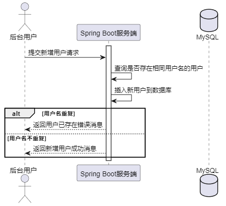

图4.9 用户添加时序图

### 数据库设计

#### 实体关系设计

根据功能需求分析与功能设计，本系统涉及到8张主要数据表，包括地址表、后台用户表、骑手表、评论表、公告表、订单表、收益明细表以及小程序用户表。这些表之间存在一定的实体关系：地址表关联小程序用户表；骑手表关联小程序用户表；评论表关联骑手表、订单表和小程序用户表；订单表关联地址表和小程序用户表；收益明细表关联小程序用户表。另外，系统采用Nacos进行服务注册与动态配置，但Nacos与业务关系不大，因此在此不作详细展示。整体实体关系如图4.10所示。

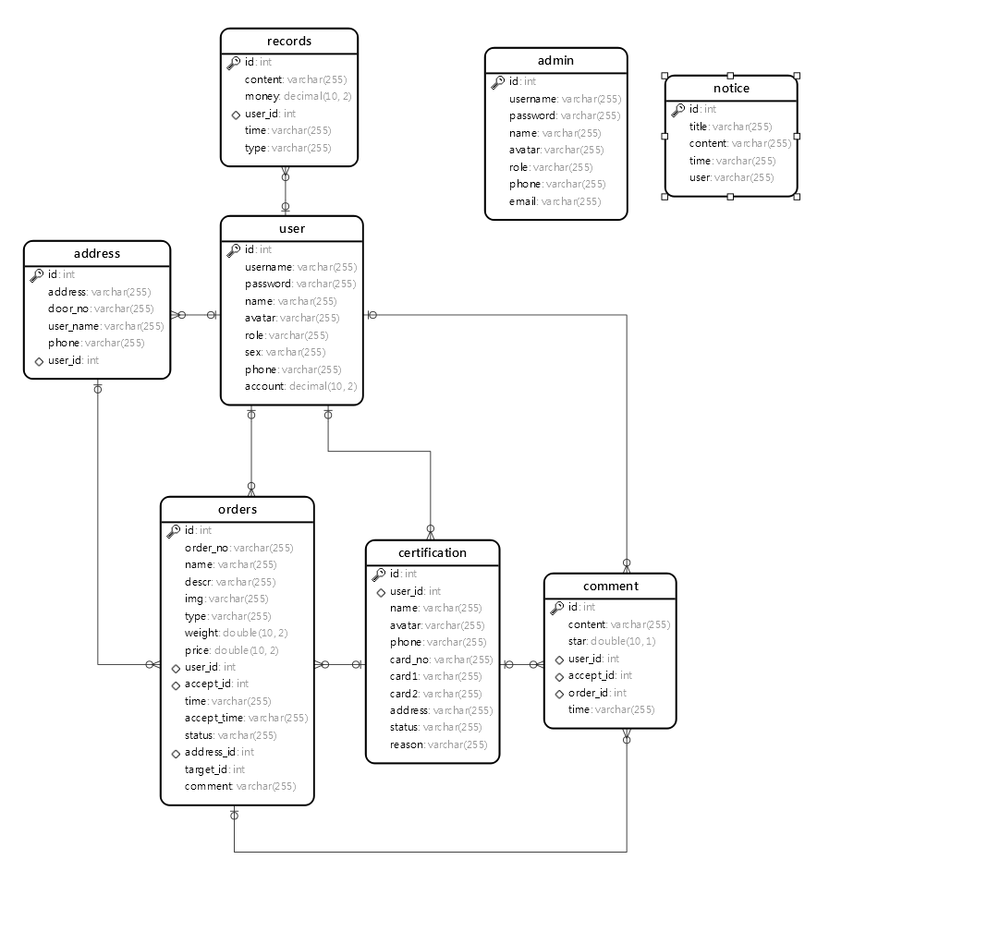

图4.10 实体关系图

#### 数据库表设计

用户信息表包含用户账号、密码、姓名、电话、头像、角色、性别、余额等字段，用于存储系统用户的个人信息，具体如表4.1所示

表4.1 用户表

<table>
<tr><td>字段名</td><td>数据类型</td><td>主键/允许空</td><td>字段含义</td></tr>
<tr><td>account</td><td>decimal(10,2)</td><td>NULL</td><td>余额</td></tr>
<tr><td>avatar</td><td>varchar(255)</td><td>NULL</td><td>头像</td></tr>
<tr><td>id</td><td>int</td><td>PRIMARY KEY</td><td>ID</td></tr>
<tr><td>name</td><td>varchar(255)</td><td>NULL</td><td>姓名</td></tr>
<tr><td>password</td><td>varchar(255)</td><td>NULL</td><td>密码</td></tr>
<tr><td>phone</td><td>varchar(255)</td><td>NULL</td><td>电话</td></tr>
<tr><td>role</td><td>varchar(255)</td><td>NULL</td><td>角色</td></tr>
<tr><td>sex</td><td>varchar(255)</td><td>NULL</td><td>性别</td></tr>
<tr><td>username</td><td>varchar(255)</td><td>NULL</td><td>账号</td></tr>
</table>

地址信息表存储了地址、门牌号、联系电话、联系人等字段，以及与用户表关联的用户ID和联系人姓名，具体如表4.2所示。

表4.2 地址表

<table>
<tr><td>字段名</td><td>数据类型</td><td>主键/允许空</td><td>字段含义</td></tr>
<tr><td>address</td><td>varchar(255)</td><td>NULL</td><td>地址</td></tr>
<tr><td>door_no</td><td>varchar(255)</td><td>NULL</td><td>门牌号</td></tr>
<tr><td>id</td><td>int</td><td>PRIMARY KEY</td><td>ID</td></tr>
<tr><td>phone</td><td>varchar(255)</td><td>NULL</td><td>联系电话</td></tr>
<tr><td>user_id</td><td>int</td><td>NULL</td><td>关联用户ID</td></tr>
<tr><td>user_name</td><td>varchar(255)</td><td>NULL</td><td>联系人</td></tr>
</table>

后台用户表包括头像、邮箱、姓名、密码、电话、角色标识、用户名等字段，以ID作为主键，具体如表4.3所示。

表4.3 后台用户表

<table>
<tr><td>字段名</td><td>数据类型</td><td>主键/允许空</td><td>字段含义</td></tr>
<tr><td>avatar</td><td>varchar(255)</td><td>NULL</td><td>头像</td></tr>
<tr><td>email</td><td>varchar(255)</td><td>NULL</td><td>邮箱</td></tr>
<tr><td>id</td><td>int</td><td>PRIMARY KEY</td><td>ID</td></tr>
<tr><td>name</td><td>varchar(255)</td><td>NULL</td><td>姓名</td></tr>
<tr><td>password</td><td>varchar(255)</td><td>NULL</td><td>密码</td></tr>
<tr><td>phone</td><td>varchar(255)</td><td>NULL</td><td>电话</td></tr>
<tr><td>role</td><td>varchar(255)</td><td>NULL</td><td>角色标识</td></tr>
<tr><td>username</td><td>varchar(255)</td><td>NULL</td><td>用户名</td></tr>
</table>

骑手表包括常住地址、本人照片、身份证正面、身份证反面、身份证号码、名称、联系方式、审核理由、审核状态等字段，以ID作为主键，并与用户表关联，如表4.4所示。

表4.4 骑手表

<table>
<tr><td>字段名</td><td>数据类型</td><td>主键/允许空</td><td>字段含义</td></tr>
<tr><td>address</td><td>varchar(255)</td><td>NULL</td><td>常住地址</td></tr>
<tr><td>avatar</td><td>varchar(255)</td><td>NULL</td><td>本人照片</td></tr>
<tr><td>card1</td><td>varchar(255)</td><td>NULL</td><td>身份证正面</td></tr>
<tr><td>card2</td><td>varchar(255)</td><td>NULL</td><td>身份证反面</td></tr>
<tr><td>card_no</td><td>varchar(255)</td><td>NULL</td><td>身份证号码</td></tr>
<tr><td>id</td><td>int</td><td>PRIMARY KEY</td><td>ID</td></tr>
<tr><td>name</td><td>varchar(255)</td><td>NULL</td><td>名称</td></tr>
<tr><td>phone</td><td>varchar(255)</td><td>NULL</td><td>联系方式</td></tr>
<tr><td>reason</td><td>varchar(255)</td><td>NULL</td><td>审核理由</td></tr>
<tr><td>status</td><td>varchar(255)</td><td>NULL</td><td>审核状态</td></tr>
<tr><td>user_id</td><td>int</td><td>NULL</td><td>账号</td></tr>
</table>

订单表包含订单编号、接单人ID、接单时间、取货地址ID、送货地址ID、物品名称、物品类型、物品重量、物品图片、小费、订单备注、描述、创建时间、订单状态等字段，以ID作为主键，并与用户表关联，具体如表4.5所示。

表4.5 订单表

<table>
<tr><td>字段名</td><td>数据类型</td><td>主键/允许空</td><td>字段含义</td></tr>
<tr><td>accept_id</td><td>int</td><td>NULL</td><td>接单人ID</td></tr>
<tr><td>accept_time</td><td>varchar(255)</td><td>NULL</td><td>接单时间</td></tr>
<tr><td>address_id</td><td>int</td><td>NULL</td><td>取货地址ID</td></tr>
<tr><td>comment</td><td>varchar(255)</td><td>NULL</td><td>订单备注</td></tr>
<tr><td>descr</td><td>varchar(255)</td><td>NULL</td><td>描述</td></tr>
<tr><td>id</td><td>int</td><td>PRIMARY KEY</td><td>ID</td></tr>
<tr><td>img</td><td>varchar(255)</td><td>NULL</td><td>物品图片</td></tr>
<tr><td>name</td><td>varchar(255)</td><td>NULL</td><td>物品名称</td></tr>
<tr><td>order_no</td><td>varchar(255)</td><td>NULL</td><td>订单编号</td></tr>
<tr><td>price</td><td>double(10,2)</td><td>NULL</td><td>小费</td></tr>
<tr><td>status</td><td>varchar(255)</td><td>NULL</td><td>订单状态</td></tr>
<tr><td>target_id</td><td>int</td><td>NULL</td><td>送货地址ID</td></tr>
<tr><td>time</td><td>varchar(255)</td><td>NULL</td><td>创建时间</td></tr>
<tr><td>type</td><td>varchar(255)</td><td>NULL</td><td>物品类型</td></tr>
<tr><td>user_id</td><td>int</td><td>NULL</td><td>发起人ID</td></tr>
<tr><td>weight</td><td>double(10,2)</td><td>NULL</td><td>物品重量</td></tr>
</table>

评论表如表4.6所示，主要存储用户的评价数据，其中user_id关联用户表，accept_id关联骑手表，order_id关联订单表。

表4.6 评论表

<table>
<tr><td>字段名</td><td>数据类型</td><td>主键/允许空</td><td>字段含义</td></tr>
<tr><td>id</td><td>int</td><td>NULL</td><td>主键</td></tr>
<tr><td>content</td><td>varchar(255)</td><td>NULL</td><td>评论内容</td></tr>
<tr><td>star</td><td>double</td><td>NULL</td><td>评分</td></tr>
<tr><td>user_id</td><td>int</td><td>NOT NULL</td><td>关联用户表</td></tr>
<tr><td>accept_id</td><td>int</td><td>NOT NULL</td><td>关联骑手表</td></tr>
<tr><td>order_id</td><td>int</td><td>NOT NULL</td><td>关联订单表</td></tr>
<tr><td>time</td><td>varchar(255)</td><td>NULL</td><td>时间</td></tr>
</table>

通知表如表4.7所示，主要存储管理员发布的通知消息。

表4.7 通知表

<table>
<tr><td>字段名</td><td>数据类型</td><td>主键/允许空</td><td>字段含义</td></tr>
<tr><td>id</td><td>int</td><td>NULL</td><td>主键</td></tr>
<tr><td>title</td><td>varchar(255)</td><td>NULL</td><td>标题</td></tr>
<tr><td>content</td><td>varchar(255)</td><td>NULL</td><td>发布内容</td></tr>
<tr><td>time</td><td>varchar(255)</td><td>NOT NULL</td><td>发布时间</td></tr>
<tr><td>user</td><td>varchar(255)</td><td>NOT NULL</td><td>发布人名称</td></tr>
</table>

金额记录表如表4.8所示，主要记录了骑手用户的收益与小程序用户的跑腿支出记录。

表4.8 金额记录表

<table>
<tr><td>字段名</td><td>数据类型</td><td>主键/允许空</td><td>字段含义</td></tr>
<tr><td>id</td><td>int</td><td>NULL</td><td>主键</td></tr>
<tr><td>content</td><td>varchar(255)</td><td>NULL</td><td>记录的内容</td></tr>
<tr><td>money</td><td>decimal</td><td>NULL</td><td>金额</td></tr>
<tr><td>user_id</td><td>int</td><td>NOT NULL</td><td>用户</td></tr>
<tr><td>time</td><td>varchar(255)</td><td>NOT NULL</td><td>时间</td></tr>
<tr><td>type</td><td>varchar(255)</td><td></td><td>类型（支出，收入）</td></tr>
</table>

## 系统实现

### Nacos服务配置实现

在项目的服务端Maven中配置Nacos引入，然后在配置文件Application.yml中引入nacos,server，并配置nacos的地址与端口，然后开发主机启动nacos，采用单机方式启动，启动命令为：.\startup.cmd -m standalone，并在Nacos中配置系统的数据库等配置文件，如图5.1所示，完成动态配置功能。

图5.1 Nacos配置

### 小程序登录与注册实现

小程序登录界面用到了<uni-forms>和<uni-easyinput>组件来构建表单，并通过validate()方法对表单进行验证。在登录方法login()中，首先进行表单验证，验证通过后使用this.$request.post()方法向后端发送登录请求。根据后端返回的结果进行相应的处理，如果登录成功，将用户信息存储在本地缓存中，并使用uni.showToast()方法显示登录成功的提示信息，然后通过uni.switchTab()方法跳转到首页；如果登录失败，则显示错误提示信息，登录界面如图5.2所示。

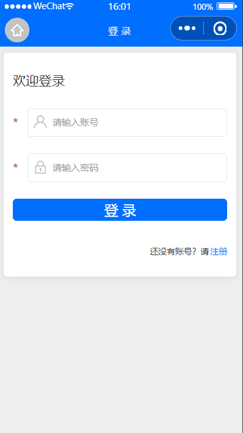

图5.2 小程序登录界面

小程序注册界面实现方式与登录一致，主要使用了 <uni-forms> 和 <uni-easyinput> 组件构建表单，其中包含账号输入框和密码输入框，并设置了相应的验证规则。在注册方法 register() 中，首先进行表单验证，验证通过后使用 $request.post() 方法向后端发送注册请求。根据后端返回的结果进行相应的处理，如果注册成功，则显示注册成功的提示信息，并跳转到登录页面；如果注册失败，则显示错误提示信息。在跳转到登录页面的方法 goLogin() 中，使用了 uni.redirectTo() 方法进行页面跳转，注册界面如图5.3所示。

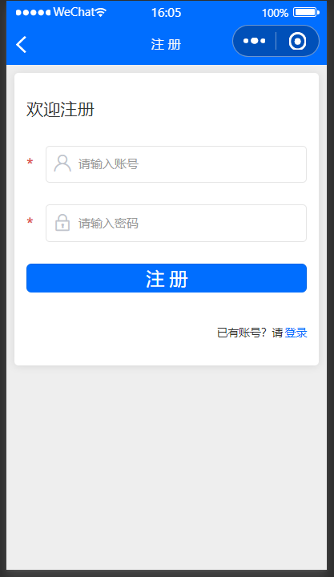

图5.3 小程序注册界面

用户在小程序登录或者注册界面中点击了登录与注册按钮，小程序通过request向服务端接口发起请求，比如发起登录，在服务端中主要使用了@PostMapping注解将登录功能映射到HTTP的POST请求。通过@RequestBody注解将请求的JSON数据绑定到Account对象上。

在实现过程中，首先通过ObjectUtil.isEmpty()方法检查传入的Account对象的用户名、密码和角色是否为空，如果为空则返回参数缺失错误。

然后根据角色信息进行登录验证，如果角色为管理员，则调用adminService.login()方法进行管理员登录验证，如果角色为用户，则调用userService.login()方法进行用户登录验证。登录验证完成后，将验证结果返回给前端，如果登录成功则返回账号信息，如果登录失败则返回相应的错误信息。

### 小程序用户下单实现

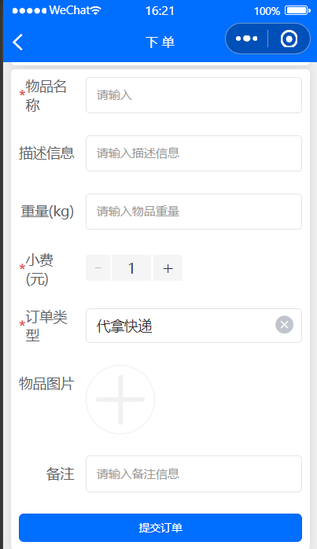

图5.4 小程序用户下单

小程序用户下单界面如图5.4所示，使用了uni-section、uni-forms、uni-forms-item、uni-easyinput、uni-number-box、uni-data-select和uni-file-picker等组件来构建表单布局，并实现了选择取货地址和收货地址、填写订单信息以及提交订单的功能。关键函数包括addOrder用于提交订单，handleImgUploadSuccess用于处理图片上传成功后的逻辑。通过uni.showToast显示提示消息，uni.navigateTo跳转地址选择页面，uni.getStorageSync获取本地缓存数据，uni.removeStorageSync清除本地缓存。

### 小程序骑手认证实现

图5.5 小程序骑手认证

小程序骑手认证界面如图5.5所示，实现过程涉及 <uni-forms>、<uni-forms-item>、<uni-easyinput>、<uni-file-picker>组件。关键函数包括handleAvatarUploadSuccess()、handleCard1UploadSuccess()、handleCard2UploadSuccess()处理上传图片，submitRequest()提交申请，load()加载认证信息，deleteRequest()删除申请。用户填写信息后提交，可上传图片，进行表单验证，发送至服务器处理，服务端存储认证信息，并将状态设置为待审核。

### 小程序骑手接单实现

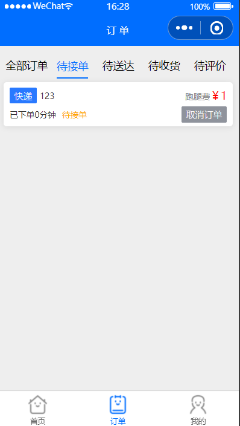

图5.6 小程序骑手接单

小程序接单界面如图5.6所示，实现过程主要涉及 <uni-segmented-control>、<uni-popup>、<uni-popup-dialog> 组件，以及点击事件处理函数 onClickItem、goDetail、handleDel、changeStatus、del、goComment、load。load函数负责加载订单列表，根据当前选择的订单状态筛选展示。点击订单状态标签可改变当前订单状态，点击删除订单时会弹出确认框，确认后执行删除操作。

骑手接单后，可以在骑手订单界面进行订单状态修改，点击确认送达按钮，小程序向服务端接口：orders/update发起请求，服务端通过Update语句修改订单状态，骑手订单界面如图5.7所示。

图5.7 骑手订单界面

### 小程序用户评价实现

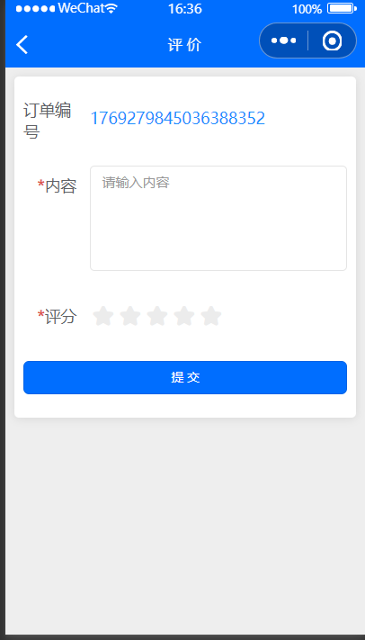

图5.8 小程序用户评价界面

小程序用户评价界面如图5.8所示，实现过程主要涉及 <uni-forms>、<uni-forms-item>、<uni-easyinput>、<uni-rate> 组件，以及点击事件处理函数 save 和加载函数 load。页面加载时通过 onLoad 方法获取订单详情，并在表单中展示订单编号。用户填写评价内容和评分后，点击提交按钮触发 save 方法，将评价内容和评分信息发送到后端保存。保存成功后显示成功提示，并延时返回上一页，只有确认取货（也就是完成的订单）小程序用户才可以进行评价，实现方式使用v-if对订单状态status进行控制。

### 订单管理实现

图5.9 订单管理界面

订单管理界面如图5.9所示，包括订单列表的展示、编辑、删除等功能。页面由搜索栏、操作按钮、订单表格和分页器组成。

搜索栏包括订单编号的输入框和查询、重置按钮。操作按钮包括批量删除按钮。

订单表格展示了订单的各项信息，并提供编辑和删除按钮。订单状态通过标签展示，点击查看取货信息和送货信息。

编辑订单信息时，弹出对话框显示订单状态，可进行修改保存。点击查看取货信息和送货信息时，弹出对话框显示地址信息。

订单管理中的定时任务，使用了Spring的@Scheduled注解，表示定时执行任务。该定时任务的主要功能是扫描订单列表，检查是否存在已经超过规定时间未被接单的订单，并自动取消这些订单。

首先，在task方法中，使用日志记录器log输出“订单扫描任务开始”的信息，表示任务开始执行。然后，创建一个Orders对象params，并设置其状态为未接单状态，即OrderStatusEnum.NO_ACCEPT.getValue()。调用ordersService.selectAll(params)方法查询所有符合条件的订单列表，返回一个订单列表ordersList。遍历订单列表ordersList，对每一个订单进行处理：获取订单的下单时间，并将其转换为DateTime对象。使用DateUtil.between方法计算当前时间与订单下单时间的间隔秒数。如果间隔秒数超过了规定时间（例如5分钟），则将订单状态设置为取消状态，并更新订单信息到数据库中。根据订单信息，查询用户信息，并将订单金额归还给用户账户。记录收支明细，表示取消订单并归还金额。最后，在任务执行结束后，使用日志记录器log输出“订单扫描任务结束”的信息，表示任务执行完成。

### 骑手认证管理实现

图5.10 骑手认证管理界面

骑手认证界面如图5.10所示，包括认证信息的展示、编辑、删除等功能。页面由搜索栏、操作按钮、认证信息表格和分页器组成。

搜索栏包括名称的输入框和查询、重置按钮。操作按钮包括批量删除按钮。

认证信息表格展示了用户的各项认证信息，并提供编辑和删除按钮。审核状态通过标签展示，点击编辑按钮可进行审核操作。

审核操作时，弹出对话框显示审核状态和审核理由，可进行修改保存。

### 用户管理功能实现

图5.11 用户管理

用户管理界面如图5.11所示，用户管理界面采用了Element UI组件构建，包括搜索框、按钮、表格和分页等。页面分为搜索框区域、操作按钮区域和数据表格及分页区域。通过定义data来管理用户列表数据、当前页码和每页显示数量等。实现了查询用户、新增用户、编辑用户、保存用户信息、删除用户和批量删除等方法。在created生命周期钩子中调用load方法加载第一页用户数据。表格使用<el-table>展示用户列表数据，并实现多选功能。使用插槽自定义表格列显示，包括头像、编辑和删除操作按钮。分页功能使用<el-pagination>组件实现，并监听页码变化事件。编辑用户弹窗使用<el-dialog>组件，保存用户信息时进行表单验证，并通过接口请求保存数据。根据后端返回结果，成功则关闭弹窗并重新加载用户列表，否则给出错误提示。支持单个和批量删除用户，通过确认对话框确认用户是否删除，并根据后端返回结果给出相应提示。

## 系统测试

### 测试环境与方法

本系统拟采用黑盒测试的方法，通过测试来检测每个功能是否都能正常使用。在测试中，把程序看作一个不能打开的黑盒子，在完全不考虑程序内部结构和内部特性的情况下，在程序接口进行测试，它只检查程序功能是否按照需求规格说明书的规定正常使用，程序是否能适当地接收输入数据而产生正确的输出信息。

系统在开发环境下进行测试：

操作系统：Windows11；

开发语言版本：JDK 1.8；MySQL 8.0.19; Node 15.6；

编译器：WebStorm，IDEA，微信Web开发者工具。

### 测试用例

登录注册测试用例如表6.1所示，主要测试登录与注册过程中，系统对数据的验证是否与设计一致。

表6.1 登录注册测试用例

<table>
<tr><td>测试序号</td><td>操作描述</td><td>数据</td><td>期望结果</td><td>实际结果</td><td>测试状态</td></tr>
<tr><td>1</td><td>用户名为空登录</td><td>用户名: &quot;&quot;</td><td>登录失败，提示用户名不能为空</td><td>登录失败，提示用户名不能为空</td><td>通过</td></tr>
<tr><td>2</td><td>密码为空登录</td><td>密码: &quot;&quot;</td><td>登录失败，提示密码不能为空</td><td>登录失败，提示密码不能为空</td><td>通过</td></tr>
<tr><td>3</td><td>用户名不存在登录</td><td>用户名: &quot;test&quot;</td><td>登录失败，提示用户名不存在</td><td>登录失败，提示用户名不存在</td><td>通过</td></tr>
<tr><td>4</td><td>密码错误登录</td><td>用户名: &quot;admin&quot;, 密码: &quot;123456&quot;</td><td>登录失败，提示密码错误</td><td>登录失败，提示密码错误</td><td>通过</td></tr>
<tr><td>5</td><td>用户名已存在注册</td><td>用户名: &quot;test&quot;, 密码: &quot;password&quot;</td><td>注册失败，提示用户名已存在</td><td>注册失败，提示用户名已存在</td><td>通过</td></tr>
</table>

下单与接单测试用例中，主要测试，没有登录的用户进行下单系统是否进行了登录拦截，余额不足的用户进行下单，系统是否进行了拦截，没有注册为骑手的用户进行接单，系统是否拦截，骑手接单且送货成功，下单用户是否可以进行确认收货，且金额是否到骑手账户，测试结果如表6.2所示。

表6.2 下单与接单测试用例

<table>
<tr><td>测试序号</td><td>操作描述</td><td>数据</td><td>期望结果</td><td>实际结果</td><td>测试状态</td></tr>
<tr><td>1</td><td>未登录用户下单</td><td>用户未登录，尝试下单</td><td>下单失败，系统跳转至登录页面</td><td>与期望一致</td><td>通过</td></tr>
<tr><td>2</td><td>余额不足下单</td><td>用户账户余额不足，尝试下单</td><td>下单失败，提示账户余额不足</td><td>与期望一致</td><td>通过</td></tr>
<tr><td>3</td><td>未注册骑手接单</td><td>未注册为骑手的用户尝试接单</td><td>接单失败，提示用户未注册为骑手</td><td>与期望一致</td><td>通过</td></tr>
<tr><td>4</td><td>骑手接单且送货成功</td><td>骑手接单并成功送货</td><td>下单用户收到货物，订单状态变为已完成，骑手账户余额增加</td><td>与期望一致</td><td>通过</td></tr>
<tr><td>5</td><td>用户确认收货</td><td>下单用户确认收货</td><td>下单用户收到货物，订单状态变为已完成，骑手账户余额增加</td><td>与期望一致</td><td>通过</td></tr>
</table>

骑手认证测试用例主要测试骑手是否可以重复认证，骑手认证申请后，后台是否可以进行审核通过与不通过，审核不通过，该用户是否可以接单，审核通过，该用户是否可接单，测试结果如表6.3所示。

表6.3 骑手认证测试用例表

<table>
<tr><td>测试序号</td><td>操作描述</td><td>数据</td><td>期望结果</td><td>实际结果</td><td>测试状态</td></tr>
<tr><td>1</td><td>骑手进行认证申请</td><td>骑手认证信息</td><td>成功提交认证申请</td><td>与期望一致</td><td>通过</td></tr>
<tr><td>2</td><td>后台审核通过认证申请</td><td>认证申请ID</td><td>审核成功</td><td>与期望一致</td><td>通过</td></tr>
<tr><td>3</td><td>后台审核不通过认证申请</td><td>认证申请ID</td><td>审核未通过</td><td>与期望一致</td><td>通过</td></tr>
<tr><td>4</td><td>审核不通过后，骑手尝试接单</td><td>接单数据</td><td>失败</td><td>与期望一致</td><td>通过</td></tr>
<tr><td>5</td><td>审核通过后，骑手尝试进行接单</td><td>接单数据</td><td>成功</td><td>与期望一致</td><td>通过</td></tr>
</table>

订单管理用例测试中，主要测试小程序用户是否可以在小程序端查看自己的订单与状态搜索，是否可以对完成的订单进行评价，后台用户是否可以查看所有小程序用户的订单数据，是否可以查看该订单的送货信息与取货信息，是否可以进行该订单的评价内容查看与删除操作。

表6.4 订单管理测试用例

<table>
<tr><td>测试序号</td><td>操作描述</td><td>数据</td><td>期望结果</td><td>实际结果</td><td>测试状态</td></tr>
<tr><td>1</td><td>小程序用户查看自己的订单与状态搜索</td><td>/</td><td>能够查看自己的订单列表</td><td>与期望一致</td><td>通过</td></tr>
<tr><td>2</td><td>小程序用户对完成的订单进行评价</td><td>订单ID、评价内容</td><td>成功对完成的订单进行评价</td><td>与期望一致</td><td>通过</td></tr>
<tr><td>3</td><td>后台用户查看所有小程序用户的订单数据</td><td>/</td><td>能够查看所有小程序用户的订单数据</td><td>与期望一致</td><td>通过</td></tr>
<tr><td>4</td><td>后台用户查看订单的送货信息与取货信息</td><td>订单ID</td><td>能够查看订单的送货信息与取货信息</td><td>与期望一致</td><td>通过</td></tr>
<tr><td>5</td><td>后台用户查看订单的评价内容与删除操作</td><td>订单ID</td><td>能够查看订单的评价内容并进行删除操作</td><td>与期望一致</td><td>通过</td></tr>
</table>

## 结论

本文介绍了基于微服务架构的社区跑腿小程序设计与实现，旨在满足当今社会对于便捷、高效的社区服务的需求。通过对管理员、用户两个角色的功能需求分析，结合现代化技术手段构建了一个功能丰富的社区跑腿服务平台。

该系统采用了先进的技术架构，包括后端采用Spring Boot + Mybatis + Redis + Nacos，前端使用Vue + ElementUI，小程序端采用Uni-App，数据库为MySQL，实现了前后端分离的模式。这一技术架构不仅提高了系统的稳定性和扩展性，还为用户提供了流畅的操作体验。

系统功能涵盖了管理员角色的登录、订单管理等，用户角色的注册、登录等。用户可以在首页浏览公告并快速下单，通过下单页设置取货地址、收货地址等信息，轻松完成订单的提交和管理。我的页面提供了个人信息管理、收支明细查看等功能，为用户提供了全方位的服务支持。

通过该系统，用户可以便捷地享受社区跑腿服务，极大地提高了生活便利度和服务质量。同时，本文还介绍了技术栈的选择和功能模块的详细设计，为类似项目的设计与实现提供了有益的参考和借鉴。

总之，基于微服务架构的社区跑腿小程序的设计与实现不仅满足了现代社会对于便捷服务的需求，还展现了现代化技术在社区服务领域的应用前景。希望本文的内容能够为社区服务平台的发展和优化提供有益的启示，为社区居民的生活带来更多的便利与舒适。
